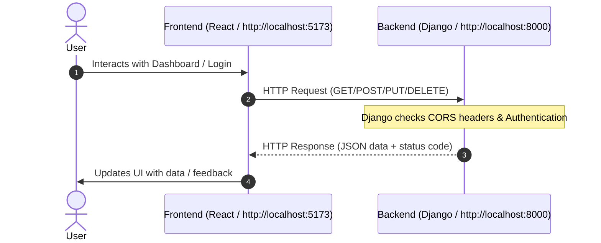

# Logisoft HR Portal Integration Guide

This guide explains how to connect and run the **Frontend (React/Vite)** and **Backend (Django REST Framework)** together locally, and how the integration flow works between them.

---

## 1. High-Level Integration Flow

The frontend acts as the user interface (running on Vite/React), and the backend (Django) handles authentication, data storage, and the business logic.



---

## 2. Step-by-Step Integration

### Step A: Configure CORS in the Backend (Django)
Because the frontend runs on a different port than the backend, browser security blocks requests unless Cross-Origin Resource Sharing (CORS) is enabled.

1. Ensure `django-cors-headers` is installed in your virtual environment:
   ```bash
   pip install django-cors-headers
   ```

2. Open the Django settings file: `Backend/project/project/settings.py`

3. Add `corsheaders` to `INSTALLED_APPS`:
   ```python
   INSTALLED_APPS = [
       ...
       'corsheaders',
       ...
   ]
   ```

4. Add `CorsMiddleware` near the top of the `MIDDLEWARE` list (above `CommonMiddleware`):
   ```python
   MIDDLEWARE = [
       'corsheaders.middleware.CorsMiddleware',
       'django.middleware.security.SecurityMiddleware',
       ...
   ]
   ```

5. Specify the allowed origins at the bottom of `settings.py`:
   ```python
   CORS_ALLOWED_ORIGINS = [
       "http://localhost:5173",
       "http://127.0.0.1:5173",
   ]
   ```

---

### Step B: Switch Frontend from Mock to Live API
In your React application, API configuration is centralized in `Frontend/src/api.ts`.

1. Open `Frontend/src/api.ts`.
2. Update the config object to use the local Django backend and disable mock data:

```typescript
export const API_CONFIG = {
  // Base URL of your local Django server
  BACKEND_BASE_URL: "http://127.0.0.1:8000/api",

  // Set this to false to connect to the live backend instead of using localStorage mock data
  USE_MOCK_API: false,

  // ... other configs
};
```

---

### Step C: How Data is Fetched
Once `USE_MOCK_API` is set to `false`, the frontend functions will execute `fetch()` requests to Django endpoints instead of storing/loading from `localStorage`.

Example frontend task fetch implementation:
```typescript
export async function loadTasksAsync(): Promise<Task[]> {
  const response = await fetch(`${API_CONFIG.BACKEND_BASE_URL}/tasks/`, {
    method: "GET",
    headers: {
      "Content-Type": "application/json",
      // Add "Authorization": "Bearer <token>" here if using JWT authentication
    }
  });
  
  if (!response.ok) {
    throw new Error("Failed to load tasks from server");
  }
  return response.json();
}
```

---

## 3. How to Run Both Services Simultaneously

Open two separate terminal windows:

### Terminal 1: Run Backend (Django)
1. Navigate to the backend project directory:
   ```bash
   cd Backend/project
   ```
2. Activate the virtual environment:
   ```bash
   ..\.venv\Scripts\activate
   ```
3. Run the development server:
   ```bash
   python manage.py runserver
   ```
   *Runs at:* `http://127.0.0.1:8000/`

### Terminal 2: Run Frontend (React/Vite)
1. Navigate to the frontend directory:
   ```bash
   cd Frontend
   ```
2. Start the Vite development server:
   ```bash
   npm run dev
   ```
   *Runs at:* `http://localhost:5173/`
